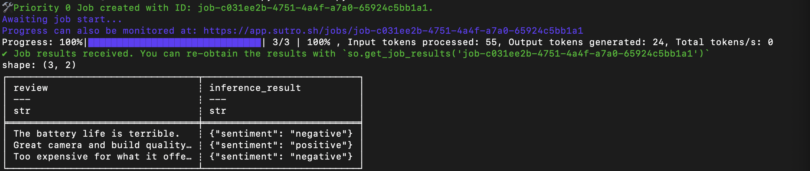

Sutro makes it easy to analyze and generate unstructured data using LLMs, from quick experiments to billion token jobs. 

Whether you're generating synthetic data, running model evals, structuring unstructured data, classifying data, or generating embeddings - *batch inference is faster, cheaper, and easier* with Sutro.

Visit [sutro.sh](https://sutro.sh) to learn more and request access to the cloud beta.

## 🚀 Quickstart

Install:

```bash
[uv] pip install sutro
```

Authenticate:

```bash
sutro login
```

### Run your first job:

```python
import sutro as so
import polars as pl
from pydantic import BaseModel

# Load your data
df = pl.DataFrame({
    "review": [
        "The battery life is terrible.",
        "Great camera and build quality!",
        "Too expensive for what it offers."
    ]
})

# Add a system prompt (optional)
system_prompt = "Classify the sentiment of the review as positive, neutral, or negative."

# Define an output schema (optional)
class Sentiment(BaseModel):
    sentiment: str

# Run a prototyping (p0) job
df = so.infer(
    df,
    column="review",
    model="qwen-3-32b",
    output_schema=Sentiment
)

print(df)
```

Will produce a result like: 



### Scaling up:

```python
# load a larger dataset
df = pl.read_parquet('hf://datasets/sutro/synthetic-product-reviews-20k/results.parquet')

# Run a production (p1) job
job_id = so.infer(
    df,
    column="review_text",
    model="qwen-3-32b",
    output_schema=Sentiment,
    job_priority=1 # <-- one line of code for near-limitless scale
)
```

You can track live progress of your job, view results, and share with your team from the Sutro web app:


## What is Sutro?

Sutro is a **serverless, high-throughput batch inference service for LLM workloads**. With just a few lines of Python, you can quickly run batch inference jobs using open-source foundation models—at scale, with strong cost/time guarantees, and without worrying about infrastructure.

Think of Sutro as **online analytical processing (OLAP) for AI**: you submit queries over unstructured data (documents, emails, product reviews, etc.), and Sutro handles the heavy lifting of job execution - from intelligent batching to cloud orchestration to inference framework and hardware optimizations. You just bring your data, and Sutro handles the rest.


## 📚 Documentation & Examples

- [Documentation](https://docs.sutro.sh/)  
- Example Guides: 
    - [Synthetic Data Zero to Hero](https://docs.sutro.sh/examples/synthetic-data-zero-to-hero)
    - [Synthetic Data for Privacy Preservation](https://docs.sutro.sh/examples/synthetic-data-privacy)
    - [Large Scale Embedding Generation with Qwen3 0.6B](https://docs.sutro.sh/examples/large-scale-embeddings)
    - More coming soon...

## ✨ Features

- **⚡ Run experiments faster**
  Small scale jobs complete in minutes, large scale jobs run within 1 hour - more than 20x faster than competing cloud services.

- **📈 Seamless scaling**  
  Use the same interface to run jobs with a few tokens, or billions at a time.

- **💰 Decreased Costs and Transparent Pricing**  
  Up to 10x cheaper than alternative inference services. Use dry run mode to estimate costs before running large jobs.

- **🐍 Pythonic DataFrame and file integrations**  
  Submit and receive results directly as Pandas/Polars DataFrames, or upload CSV/Parquet files.

- **🏗️ Zero infrastructure setup**  
  No need to manage GPUs, tune inference frameworks, or orchestrate parallelization. Just data in, results out.

- **📊 Real-time observability dashboard**
  Use the Sutro web app to monitor your jobs in real-time and see results as they are generated, tag jobs for easier tracking, and share results with your team.

- **🔒 Built with security in mind**  
  Custom data retention options, and bring-your-own s3-compatible storage options available.


## 🧑‍💻 Typical Use Cases

- **Synthetic data generation**: Create millions of product reviews, conversations, or paraphrases for pre-training or distillation.
- **Model evals**: Easily run LLM benchmarks on a scheduled basis to detect model regressions or performance degradation.
- **Unstructured data analytics**: Run analytical workloads over unstructured data (e.g. customer reviews, product descriptions, emails, etc.).
- **Semantic tagging**: Add boolean/numeric/closed-set tags to messy data (e.g. LinkedIn bios, company descriptions).  
- **Structured Extraction**: Pull structured fields out of unstructured documents at scale.  
- **Classification**: Apply consistent labels across large datasets (spam, sentiment, topic, compliance risk).  
- **Embedding generation**: Generate and store embeddings for downstream search/analytics.  

## 🔌 Integrations

- **DataFrames**: Pandas, Polars  
- **Files**: CSV, Parquet  
- **Storage**: S3-Compatible Object Stores (e.g. R2, S3, GCS, etc.)

## 📦 Hosting Options

- **Cloud**: Run Sutro on our secure, multi-tenant cloud.
- **Isolated Deployments**: Bring your own storage, models, or cloud resources.
- **Local and Self-Hosted**: Coming soon!

See our [pricing page](https://sutro.sh/pricing) for more details.

## 🤝 Contributing

We welcome contributions! Please reach out to us at [team@sutro.sh](mailto:team@sutro.sh) to get involved.

## 📄 License

Apache 2.0