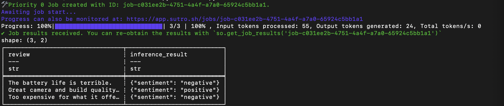

[](https://pypi.org/project/sutro/)
[](https://pypi.org/project/sutro/)

# Sutro Python SDK

Sutro helps teams build grounded LLM judges, classifiers, and extractors, then run them confidently at scale.

Use Sutro when you need reliable offline AI over tables, traces, documents, or other collections of unstructured data:

- Judge model outputs, agent traces, and QA gates
- Classify tickets, leads, documents, events, and messy business records
- Extract structured fields, spans, labels, and normalized schemas
- Run large-scale evals, synthetic data generation, semantic tagging, and embeddings

Visit [sutro.sh](https://sutro.sh), read the [docs](https://docs.sutro.sh/), or [get access](https://sutro.sh) to start using Sutro. Sutro Functions are currently in research preview; contact [team@sutro.sh](mailto:team@sutro.sh) for access, design-partner support, higher quotas, or enterprise deployment options.

## What You Can Run

### Sutro Functions

Sutro Functions are task-specific judges, classifiers, and extractors aligned to your decision preferences. Instead of hand-maintaining prompts, you define the task, review ambiguous examples, add rationale where needed, and deploy a reusable Function that can be invoked online or in batch.

Typical Functions include:

- Support-agent pass/fail judges
- Lead qualification and routing
- Trust, safety, fraud, spam, or compliance classifiers
- Document categorization and structured extraction
- Data quality filters and normalization steps
- Model and query routers

### Sutro Batch

Sutro Batch is serverless async inference for high-volume AI workloads. Run Sutro Functions, custom models, or pre-trained open-source LLMs over large datasets with simple usage-based pricing, DataFrame-friendly inputs and outputs, live observability, and result downloads.

Batch is best when latency is less important than quality, cost, throughput, and reproducibility.

## Quickstart

### Install

```bash
pip install sutro
```

With `uv`:

```bash
uv pip install sutro
```

### Authenticate

```bash
sutro login
```

This stores your API key locally for future SDK and CLI calls. You can also set a key inside Python:

```python
import sutro as so

so.set_api_key("sk_...")
```

## Run a Sutro Function

If your team has published a Function, call it by name with the input fields it expects.

```python
import sutro as so


result = so.run_function(
    name="support-agent-judge",
    input_data={
        "conversation": "Customer: I cannot log in. Agent: I reset your password.",
        "rubric": "Pass if the agent directly resolves the customer issue.",
    },
)

print(result)
```

For larger datasets, use the same Function through Batch:

```python
import polars as pl
import sutro as so


df = pl.DataFrame(
    {
        "conversation": [
            "Customer: I cannot log in. Agent: I reset your password.",
            "Customer: Where is my refund? Agent: Please contact your bank.",
        ],
        "rubric": [
            "Pass if the agent directly resolves the customer issue.",
            "Pass if the agent gives a correct refund status or next step.",
        ],
    }
)

job_id = so.batch_run_function(
    name="support-agent-judge",
    data=df,
    job_priority=1,
    job_name="support-agent-eval",
)

results = so.await_job_completion(job_id)
print(results)
```

Function inputs must match the schema configured for that Function in Sutro. Replace the Function name and fields above with your published Function.

## Run Standalone Batch Inference

You can also run pre-trained LLMs directly with `infer`. This is useful for prototyping, evals, extraction, classification, generation, and one-off data transformations.

```python
import polars as pl
import sutro as so
from pydantic import BaseModel


df = pl.DataFrame(
    {
        "review": [
            "The battery life is terrible.",
            "Great camera and build quality!",
            "Too expensive for what it offers.",
        ]
    }
)


class ReviewSentiment(BaseModel):
    sentiment: str
    rationale: str


job_id = so.infer(
    data=df,
    column="review",
    model="gpt-oss-20b",
    system_prompt=(
        "Classify each product review as positive, neutral, or negative. "
        "Return a short rationale."
    ),
    output_schema=ReviewSentiment,
    stay_attached=False,
)

results = so.await_job_completion(job_id)
print(results)
```

`infer()` returns a job ID. Priority 0 jobs are the default and are meant for prototyping; if you omit `stay_attached=False`, the SDK streams progress and prints a result preview in your terminal.



## Move to Production

Sutro supports two Batch priorities today:

- `job_priority=0`: prototyping jobs for smaller runs and fast iteration
- `job_priority=1`: production jobs for larger workloads and higher quotas

Before running a large job, use `dry_run=True` to estimate cost.

```python
import polars as pl
import sutro as so


df = pl.read_parquet(
    "hf://datasets/sutro/synthetic-product-reviews-20k/results.parquet"
)

estimate = so.infer(
    data=df,
    column="review_text",
    model="gpt-oss-20b",
    system_prompt="Summarize the review in one sentence.",
    job_priority=1,
    dry_run=True,
)
print(estimate)

job_id = so.infer(
    data=df,
    column="review_text",
    model="gpt-oss-20b",
    system_prompt="Summarize the review in one sentence.",
    job_priority=1,
    name="review-summary-prod",
)

results = so.get_job_results(job_id, include_inputs=True)
print(results.head())
```

You can monitor live progress, inspect samples, tag jobs, and share results from the Sutro web app.


## Data Sources

The SDK accepts:

- Python lists
- Pandas and Polars DataFrames
- Local CSV, Parquet, and TXT files
- HTTP(S) CSV or Parquet download URLs
- Sutro dataset IDs for larger uploaded datasets

Results preserve input order. SDK result helpers return Polars DataFrames by default and can join results back to the original Pandas or Polars DataFrame.

## More SDK Patterns

### Multi-model comparison

```python
import sutro as so


job_ids = so.infer_per_model(
    data=["Explain quantum computing in simple terms."],
    models=["gpt-oss-20b", "gpt-oss-120b"],
    names=["gpt-oss-20b-test", "gpt-oss-120b-test"],
    system_prompt="Give a concise, accurate answer.",
)
```

### Embeddings

```python
import sutro as so


results = so.embed(
    data=["battery life", "camera quality", "price sensitivity"],
    model="qwen-3-embedding-0.6b",
)
```

### Job management

```python
so.list_jobs()
so.get_job_status(job_id)
so.attach(job_id)
so.await_job_completion(job_id)
so.get_job_results(job_id, include_inputs=True)
so.cancel_job(job_id)
so.get_quotas()
```

CLI equivalents:

```bash
sutro jobs list
sutro jobs status <job_id>
sutro jobs attach <job_id>
sutro jobs results <job_id> --save --save-format parquet
sutro quotas
```

## Documentation

- [Sutro Docs](https://docs.sutro.sh/)
- [Quickstart](https://docs.sutro.sh/quickstart)
- [Sutro Functions](https://docs.sutro.sh/sutro-functions)
- [Python SDK: Batch Inference](https://docs.sutro.sh/python-sdk/batch-inference)
- [Python SDK: Functions](https://docs.sutro.sh/python-sdk/functions)
- [Models and Pricing](https://sutro.sh/pricing)
- [Synthetic Data Zero to Hero](https://docs.sutro.sh/examples/synthetic-data-zero-to-hero)
- [Synthetic Data for Privacy Preservation](https://docs.sutro.sh/examples/synthetic-data-privacy)
- [Large Scale Embedding Generation](https://docs.sutro.sh/examples/large-scale-embeddings)
- [LLM-as-a-Judge](https://docs.sutro.sh/examples/llm-as-a-judge)

## Security and Deployment

Sutro runs on a managed cloud by default. Job result data and user datasets are retained for up to 90 days by default, with configurable retention options in the web app. Enterprise deployments can support custom retention, custom integrations, custom models, or isolated cloud requirements.

For security, deployment, or procurement questions, contact [team@sutro.sh](mailto:team@sutro.sh).

## Contributing

We welcome contributions and feedback. Please reach out at [team@sutro.sh](mailto:team@sutro.sh) before larger changes so we can coordinate.

## License

Apache-2.0
